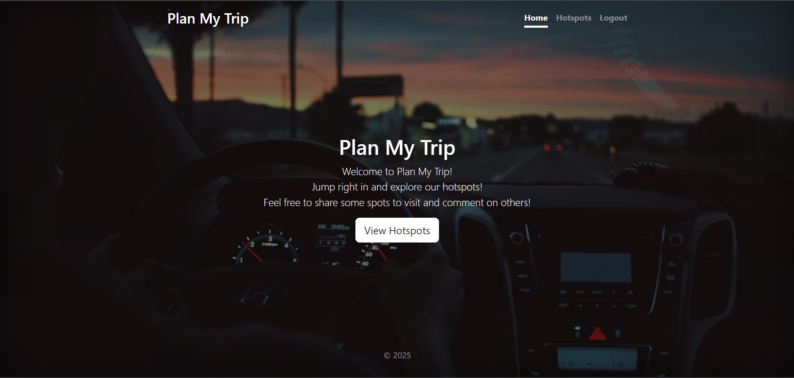

# Plan My Trip

**Plan My Trip** is a full-stack web application that helps users discover and plan trips to various travel destinations. The app allows users to browse popular destinations, view detailed information, and even create, update, or delete their own trip plans. Built with Node.js, Express, MongoDB, and other modern web technologies, this app brings a seamless experience for users looking to plan their next adventure.

## Inspiration

This project was inspired by **YelpCamp**, a project from Colt Steele's **Web Developer Bootcamp** course on Udemy. Colt’s teaching style and detailed guidance played a crucial role in helping me understand full-stack web development and inspired me to create a project focused on helping users plan their trips.

## Features

- **User Authentication**: Users can sign up, log in, and manage their accounts.
- **Trip Destinations**: Users can browse, create, and view trip destinations.
- **Interactive Maps**: See destinations on an interactive map and get location-based information.
- **Reviews and Ratings**: Users can leave reviews and ratings for destinations they’ve visited.
- **User Profiles**: Manage your trip plans and see your past reviews and trips.
- **Responsive Design**: The app is fully responsive, making it easy to use on any device.

## Tech Stack

- **Frontend**: HTML, CSS, JavaScript, EJS
- **Backend**: Node.js, Express
- **Database**: MongoDB
- **Authentication**: Passport.js
- **Map Integration**: Maptiler API
- **Deployment**: Render (https://plan-my-trip-f3rh.onrender.com)

## Installation

To run this project locally, follow these steps:

1. **Clone the repository**:
   ```bash
   git clone https://github.com/jeswindany/plan-my-trip.git
   ```

2. **Navigate into the project folder**:
   ```bash
   cd plan-my-trip
   ```

3. **Install dependencies**:
   ```bash
   npm install
   ```

4. **Set up environment variables**:
   Create a `.env` file in the root of your project with the following variables:

   ```
   CLOUDINARY_CLOUD_NAME=your-cloudinary-cloud-name
   CLOUDINARY_KEY=your-cloudinary-key
   CLOUDINARY_SECRET=your-cloudinary-secret
   MAPTILER_API_KEY=your-maptiler-api-key
   DB_URL=your-mongodb-url
   SECRET=your-secret
   ```

5. **Start the server**:
   ```bash
   npm start
   ```

6. Visit `http://localhost:3000` in your browser.

## Screenshots



## Contributions

Feel free to fork the repository, open issues, and submit pull requests if you'd like to contribute to the project. All contributions are welcome!

## License

This project is licensed under the MIT License - see the [LICENSE](LICENSE) file for details.

---
